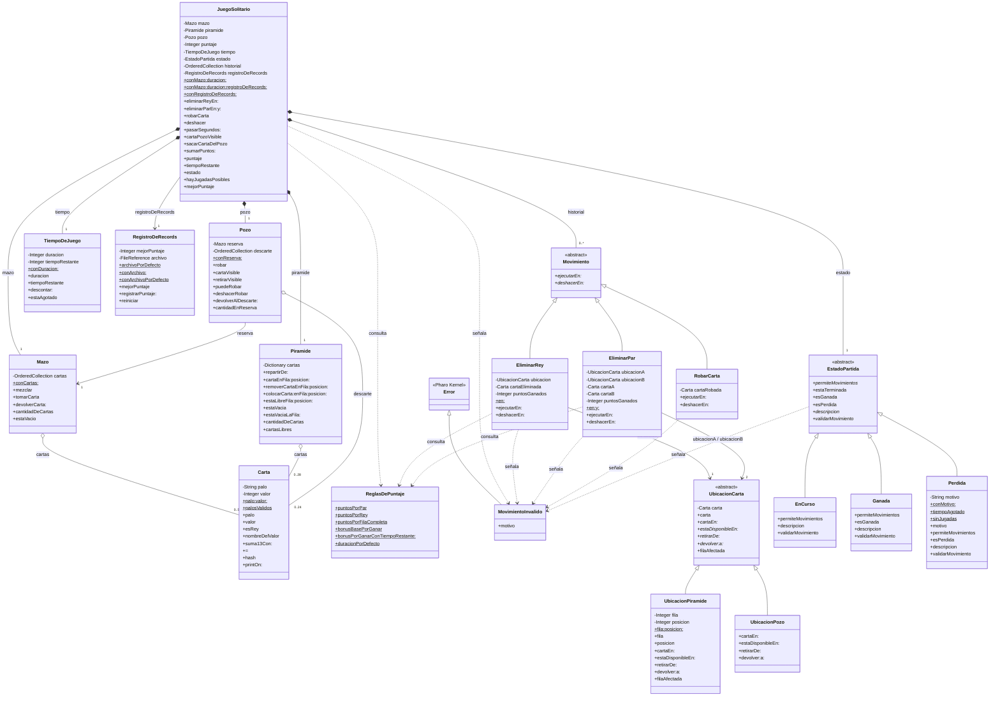

# Diagrama de Clases — SolitarioPiramide-Modelo

Diagrama de clases del dominio (`SolitarioPiramide-Modelo`) del Solitario de Pirámide en Pharo 12.

```mermaid
classDiagram
    direction TB

    class JuegoSolitario {
        -Mazo mazo
        -Piramide piramide
        -Pozo pozo
        -Integer puntaje
        -TiempoDeJuego tiempo
        -EstadoPartida estado
        -OrderedCollection historial
        -RegistroDeRecords registroDeRecords
        +conMazo:duracion:$
        +conMazo:duracion:registroDeRecords:$
        +conRegistroDeRecords:$
        +eliminarReyEn:
        +eliminarParEn:y:
        +robarCarta
        +deshacer
        +pasarSegundos:
        +cartaPozoVisible
        +sacarCartaDelPozo
        +sumarPuntos:
        +puntaje
        +tiempoRestante
        +estado
        +hayJugadasPosibles
        +mejorPuntaje
    }

    class Carta {
        -String palo
        -Integer valor
        +palo:valor:$
        +palosValidos$
        +palo
        +valor
        +esRey
        +nombreDelValor
        +suma13Con:
        +=
        +hash
        +printOn:
    }

    class Mazo {
        -OrderedCollection cartas
        +conCartas:$
        +mezclar
        +tomarCarta
        +devolverCarta:
        +cantidadDeCartas
        +estaVacio
    }

    class Piramide {
        -Dictionary cartas
        +repartirDe:
        +cartaEnFila:posicion:
        +removerCartaEnFila:posicion:
        +colocarCarta:enFila:posicion:
        +estaLibreFila:posicion:
        +estaVacia
        +estaVaciaLaFila:
        +cantidadDeCartas
        +cartasLibres
    }

    class Pozo {
        -Mazo reserva
        -OrderedCollection descarte
        +conReserva:$
        +robar
        +cartaVisible
        +retirarVisible
        +puedeRobar
        +deshacerRobar
        +devolverAlDescarte:
        +cantidadEnReserva
    }

    class TiempoDeJuego {
        -Integer duracion
        -Integer tiempoRestante
        +conDuracion:$
        +duracion
        +tiempoRestante
        +descontar:
        +estaAgotado
    }

    class ReglasDePuntaje {
        +puntosPorPar$
        +puntosPorRey$
        +puntosPorFilaCompleta$
        +bonusBasePorGanar$
        +bonusPorGanarConTiempoRestante:$
        +duracionPorDefecto$
    }

    class RegistroDeRecords {
        -Integer mejorPuntaje
        -FileReference archivo
        +archivoPorDefecto$
        +conArchivo:$
        +conArchivoPorDefecto$
        +mejorPuntaje
        +registrarPuntaje:
        +reiniciar
    }

    class MovimientoInvalido {
        +motivo
    }

    class Error {
        <<Pharo Kernel>>
    }

    class UbicacionCarta {
        <<abstract>>
        -Carta carta
        +carta
        +cartaEn:*
        +estaDisponibleEn:*
        +retirarDe:*
        +devolver:a:*
        +filaAfectada
    }

    class UbicacionPiramide {
        -Integer fila
        -Integer posicion
        +fila:posicion:$
        +fila
        +posicion
        +cartaEn:
        +estaDisponibleEn:
        +retirarDe:
        +devolver:a:
        +filaAfectada
    }

    class UbicacionPozo {
        +cartaEn:
        +estaDisponibleEn:
        +retirarDe:
        +devolver:a:
    }

    class EstadoPartida {
        <<abstract>>
        +permiteMovimientos*
        +estaTerminada
        +esGanada
        +esPerdida
        +descripcion*
        +validarMovimiento*
    }

    class EnCurso {
        +permiteMovimientos
        +descripcion
        +validarMovimiento
    }

    class Ganada {
        +permiteMovimientos
        +esGanada
        +descripcion
        +validarMovimiento
    }

    class Perdida {
        -String motivo
        +conMotivo:$
        +tiempoAgotado$
        +sinJugadas$
        +motivo
        +permiteMovimientos
        +esPerdida
        +descripcion
        +validarMovimiento
    }

    class Movimiento {
        <<abstract>>
        +ejecutarEn:*
        +deshacerEn:*
    }

    class EliminarRey {
        -UbicacionCarta ubicacion
        -Carta cartaEliminada
        -Integer puntosGanados
        +en:$
        +ejecutarEn:
        +deshacerEn:
    }

    class EliminarPar {
        -UbicacionCarta ubicacionA
        -UbicacionCarta ubicacionB
        -Carta cartaA
        -Carta cartaB
        -Integer puntosGanados
        +en:y:$
        +ejecutarEn:
        +deshacerEn:
    }

    class RobarCarta {
        -Carta cartaRobada
        +ejecutarEn:
        +deshacerEn:
    }

    %% Herencias
    Error <|-- MovimientoInvalido
    UbicacionCarta <|-- UbicacionPiramide
    UbicacionCarta <|-- UbicacionPozo
    EstadoPartida <|-- EnCurso
    EstadoPartida <|-- Ganada
    EstadoPartida <|-- Perdida
    Movimiento <|-- EliminarRey
    Movimiento <|-- EliminarPar
    Movimiento <|-- RobarCarta

    %% Composiciones y asociaciones principales
    JuegoSolitario *-- "1" Mazo : mazo
    JuegoSolitario *-- "1" Piramide : piramide
    JuegoSolitario *-- "1" Pozo : pozo
    JuegoSolitario *-- "1" TiempoDeJuego : tiempo
    JuegoSolitario *-- "1" EstadoPartida : estado
    JuegoSolitario *-- "0..*" Movimiento : historial
    JuegoSolitario --> "1" RegistroDeRecords : registroDeRecords
    JuegoSolitario ..> ReglasDePuntaje : consulta
    JuegoSolitario ..> MovimientoInvalido : señala

    Mazo o-- "0..52" Carta : cartas
    Piramide o-- "0..28" Carta : cartas
    Pozo --> "1" Mazo : reserva
    Pozo o-- "0..24" Carta : descarte

    EliminarRey --> "1" UbicacionCarta : ubicacion
    EliminarPar --> "2" UbicacionCarta : ubicacionA / ubicacionB
    EliminarRey ..> ReglasDePuntaje : consulta
    EliminarPar ..> ReglasDePuntaje : consulta
    EliminarRey ..> MovimientoInvalido : señala
    EliminarPar ..> MovimientoInvalido : señala
    RobarCarta ..> MovimientoInvalido : señala
    EstadoPartida ..> MovimientoInvalido : señala
```
